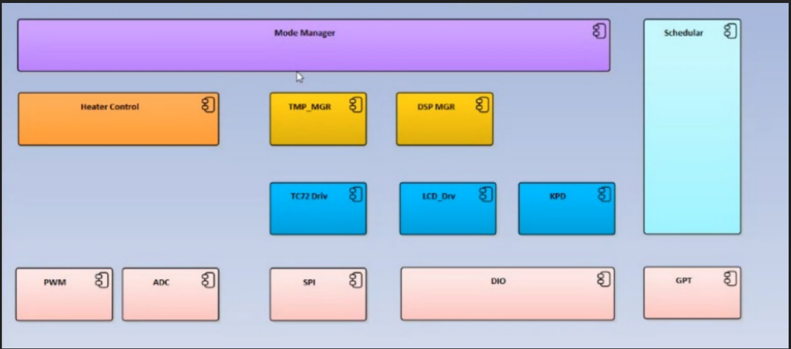

[Demo](https://youtu.be/i1L2zUYyZUE)

## System objective:
System is designed to provide a temperature controlled functionality. The system shall
provide the ability to reach a targeted temperature requested by a user interface. The
system shall provide information for the user about the system state, the current
temperature and the selected set temperature.

## System Architecture:

## System Components:
System is consisted of the following:
1. Atmega32 Microcontroller.
2. LM016 character LCD.
3. TC72 SPI to temperature convertor.
4. 4X3 Keypad.
5. PWM to voltage convertor module.
6. Calibration resistor.
7. 

## System application behavior:

* **1. Welcome screen:** 
  * 1. After power on, system shall display an animated welcome screen. 
  * 2. The welcome Screen shall display the word “WELCOME” on the Character LCD.
  * 3. The welcome word shall move from right to left until the end of the screen.
  * 4. The welcome word shall move from left to right until the other end of the screen.
  * 5. The time of each movement step shall be 100ms.
  * 6. Steps from 3 to 5 shall be repeated 3 times.
  * 7. System shall then switch to IDLE screen with the last saved set temperature.
* **2. IDLE screen:**
  * 1. IDLE screen consists of three sections, Set temperature, current temperature and system state.
  * 2. Set temperature section shall be allocated on the left side of the screen from Row0 col0 to Row0 Col5.
  * 3. Set temperature section shall be written on the form SET:XX where XX is the Set temperature value.
  * 4. Set temperature value shall be changed based on a user entry from the 4X3 Keypad.
  * 5. If Set temperature is less than 10, its value shall be written on the form 0X.
  * 6. Current temperature section shall be allocated on the right side of the screen from Row0 Col10 to Row0 Col15.
  * 7. Current temperature section shall be written on the form CRT:YY where YY is the current temperature value.
  * 8. Current temperature shall be changed based on the current value read from the LM35 Temperature sensor.
  * 9. System state section shall be allocated on the down left of the screen from row1 Col0 to row1 Col15.
  * 10. System state section shall be written on the form STATE: SSSSS. Where SSSSS is equal to the system state.
  * 11. System state shall vary from STANDBY, OPERATIONAL, NORMAL and ERROR based on the current system state.
* **3. System states:**
  * 1. After power on, Systems state shall be STANDBY.
  * 2. STANDBY state means system is not operational, no temperature reading and no Voltage module control (PWM output is 0).
  * 3. Upon the click on the # button in Keypad, system shall move from STANDBY to OPERATIONAL.
  * 4. In operational state, System shall read the current temperature periodically every 200ms.
  * 5. In operational state, System shall drive PWM to voltage convertor based on the 
  following equation: 
  V = ((Set temperature – Current Temperature) / 100) * 5 if Set temperature > Current Temperature. 
  V = 0 if Set temperature <= Current Temperature. 
  Where V is the delivered voltage from the PWM to Voltage convertor.
  * 6. In operational state, if Current temperature > Set temperature and (Current temperature – Set temperature) <= 5 system shall enter NORMAL state.
  * 7. In operational state, if Current temperature < Set temperature and (Set temperature – Current temperature) <= 5 system shall enter NORMAL state.
  * 8. In operational state, if Current temperature > Set temperature and (Current temperature – Set temperature) > 10 system shall enter Error state. In operational state, if Set temperature > Current temperature and (Set
  temperature – Current temperature) > 5 for more than 3 minutes, system shall
  enter Error state.
  * 10. In operational state, if # key is pressed, System shall enter STANDBY State.
  * 11. In Normal state, Periodic temperature reading is exist with voltage V = 0.
  * 12. In Error state, no temperature read and no PWM to voltage module control.
  * 13. The only exit from Error state is to power off the system. Keypad shall not be functional.
  
* **4. Calibration Resistor:**
  * 1. Calibration resistor is used to define the percentage of average voltage to be delivered to the PWM to Voltage convertor.
  * 2. Calibration resistor is a three terminal potentiometer formulate a voltage divider circuit. One terminal on VCC, other terminal on Ground and the middle terminal shall be read by the microcontroller.
  * 3. The Calibration resistor voltage shall be read every 500ms in both Operational and normal states.
  
  
* **5. PWM to voltage convertor:**
  * 1. The PWM transfer voltage module LC-LM358-PWM2V converts the PWM digital signals into 0 to 10V analog signals.
  * 2. The device shall be connected to the microcontroller only via PWM input.
  * 3. The accepted PWM frequency is from 1KHZ to 3KHZ.
  * 4. The value of the delivered PWM duty cycle is dependent on the targeted voltage and value of the calibration resistor voltage.
    Duty Cycle percentage = (((Vr * 2)/10) * Vt) / 10.
    Where Vr is the calibration resistor voltage, Vt is the target voltage as described
    in system states.
* **6. Temperature sensor:**
    * 1. TC72 is a temperature to SPI convertor.
    * 2. Recommended system mode is the continues mode.
    * 3. More information about the sensor constraints is located in its datasheets.
* **7. General constraints:**
    * 1. Refer to 4X3 phone keypad for keypad interface.
    * 2. Refer to Chapter 12 in AVR mazidi for LM016 LCD interface.
    * 3. LCD shall be used in 4 pin data mode.
    * 4. All timing constraints shall be respected.
    * 5. <strong style="color: red;">No delay loops is allowed for a time higher than 100us.</strong>
    * 6. Code shall not have any unjustified MISRA violations.
